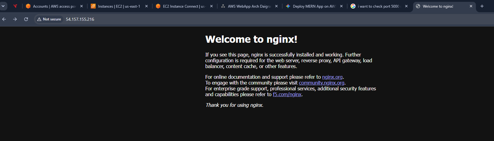
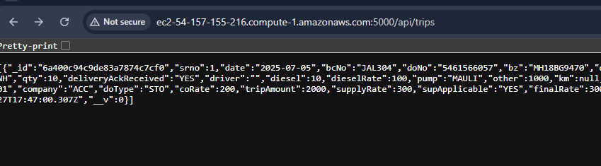

Backend Setup - 

Terminal Log - 

```

   ,     #_
   ~\_  ####_        Amazon Linux 2023
  ~~  \_#####\
  ~~     \###|
  ~~       \#/ ___   https://aws.amazon.com/linux/amazon-linux-2023
   ~~       V~' '->
    ~~~         /
      ~~._.   _/
         _/ _/
       _/m/'
Last login: Sat Jun 27 09:42:29 2026 from 103.120.95.234
[ec2-user@ip-172-31-49-38 ~]$ ll
total 0
drwxrwxr-x. 2 ec2-user ec2-user 6 Jun 27 17:07 backend
[ec2-user@ip-172-31-49-38 ~]$ cd backend/
[ec2-user@ip-172-31-49-38 backend]$ ll
total 0
[ec2-user@ip-172-31-49-38 backend]$ fresh
[ec2-user@ip-172-31-49-38 backend]$ ll
total 12
-rw-r--r--. 1 ec2-user ec2-user  125 Jun 27 17:19 package.json
-rw-r--r--. 1 ec2-user ec2-user 7535 Jun 27 17:18 server.js
[ec2-user@ip-172-31-49-38 backend]$ ll -a
total 32
drwxrwxr-x. 2 ec2-user ec2-user    55 Jun 27 17:19 .
drwx------. 9 ec2-user ec2-user 16384 Jun 27 17:17 ..
-rw-r--r--. 1 ec2-user ec2-user   116 Jun 27 17:19 .env
-rw-r--r--. 1 ec2-user ec2-user   125 Jun 27 17:19 package.json
-rw-r--r--. 1 ec2-user ec2-user  7535 Jun 27 17:18 server.js
[ec2-user@ip-172-31-49-38 backend]$ node -v
-bash: node: command not found
```

## 
[ec2-user@ip-172-31-49-38 backend]$ sudo dnf install nodejs -y

```
Last metadata expiration check: 7:38:12 ago on Sat Jun 27 09:43:48 2026.
Dependencies resolved.
===================================================================================================================================================================================================================
 Package                                           Architecture                            Version                                                              Repository                                    Size
===================================================================================================================================================================================================================
Installing:
 nodejs                                            x86_64                                  1:18.20.8-1.amzn2023.0.2                                             amazonlinux                                   13 M
Installing dependencies:
 libbrotli                                         x86_64                                  1.0.9-4.amzn2023.0.2                                                 amazonlinux                                  315 k
 nodejs-libs                                       x86_64                                  1:18.20.8-1.amzn2023.0.2                                             amazonlinux                                   14 M
Installing weak dependencies:
 nodejs-docs                                       noarch                                  1:18.20.8-1.amzn2023.0.2                                             amazonlinux                                  7.8 M
 nodejs-full-i18n                                  x86_64                                  1:18.20.8-1.amzn2023.0.2                                             amazonlinux                                  8.4 M
 nodejs-npm                                        x86_64                                  1:10.8.2-1.18.20.8.1.amzn2023.0.2                                    amazonlinux                                  1.9 M

Transaction Summary
===================================================================================================================================================================================================================
Install  6 Packages

Total download size: 45 M
Installed size: 224 M
Downloading Packages:
(1/6): libbrotli-1.0.9-4.amzn2023.0.2.x86_64.rpm                                                                                                                                   4.8 MB/s | 315 kB     00:00    
(2/6): nodejs-docs-18.20.8-1.amzn2023.0.2.noarch.rpm                                                                                                                                54 MB/s | 7.8 MB     00:00    
(3/6): nodejs-18.20.8-1.amzn2023.0.2.x86_64.rpm                                                                                                                                     54 MB/s |  13 MB     00:00    
(4/6): nodejs-full-i18n-18.20.8-1.amzn2023.0.2.x86_64.rpm                                                                                                                           37 MB/s | 8.4 MB     00:00    
(5/6): nodejs-npm-10.8.2-1.18.20.8.1.amzn2023.0.2.x86_64.rpm                                                                                                                        24 MB/s | 1.9 MB     00:00    
(6/6): nodejs-libs-18.20.8-1.amzn2023.0.2.x86_64.rpm                                                                                                                                51 MB/s |  14 MB     00:00    
-------------------------------------------------------------------------------------------------------------------------------------------------------------------------------------------------------------------
Total                                                                                                                                                                               97 MB/s |  45 MB     00:00     
Running transaction check
Transaction check succeeded.
Running transaction test
Transaction test succeeded.
Running transaction
  Preparing        :                                                                                                                                                                                           1/1 
  Installing       : nodejs-docs-1:18.20.8-1.amzn2023.0.2.noarch                                                                                                                                               1/6 
  Installing       : libbrotli-1.0.9-4.amzn2023.0.2.x86_64                                                                                                                                                     2/6 
  Installing       : nodejs-libs-1:18.20.8-1.amzn2023.0.2.x86_64                                                                                                                                               3/6 
  Installing       : nodejs-full-i18n-1:18.20.8-1.amzn2023.0.2.x86_64                                                                                                                                          4/6 
  Installing       : nodejs-npm-1:10.8.2-1.18.20.8.1.amzn2023.0.2.x86_64                                                                                                                                       5/6 
  Installing       : nodejs-1:18.20.8-1.amzn2023.0.2.x86_64                                                                                                                                                    6/6 
  Running scriptlet: nodejs-1:18.20.8-1.amzn2023.0.2.x86_64                                                                                                                                                    6/6 
INFO: registered node-18 in the alternatives

  Verifying        : libbrotli-1.0.9-4.amzn2023.0.2.x86_64                                                                                                                                                     1/6 
  Verifying        : nodejs-1:18.20.8-1.amzn2023.0.2.x86_64                                                                                                                                                    2/6 
  Verifying        : nodejs-docs-1:18.20.8-1.amzn2023.0.2.noarch                                                                                                                                               3/6 
  Verifying        : nodejs-full-i18n-1:18.20.8-1.amzn2023.0.2.x86_64                                                                                                                                          4/6 
  Verifying        : nodejs-libs-1:18.20.8-1.amzn2023.0.2.x86_64                                                                                                                                               5/6 
  Verifying        : nodejs-npm-1:10.8.2-1.18.20.8.1.amzn2023.0.2.x86_64                                                                                                                                       6/6 

Installed:
  libbrotli-1.0.9-4.amzn2023.0.2.x86_64            nodejs-1:18.20.8-1.amzn2023.0.2.x86_64                   nodejs-docs-1:18.20.8-1.amzn2023.0.2.noarch      nodejs-full-i18n-1:18.20.8-1.amzn2023.0.2.x86_64     
  nodejs-libs-1:18.20.8-1.amzn2023.0.2.x86_64      nodejs-npm-1:10.8.2-1.18.20.8.1.amzn2023.0.2.x86_64     

Complete!


[ec2-user@ip-172-31-49-38 backend]$ 

```


##

[ec2-user@ip-172-31-49-38 backend]$ node server.js 

```
node:internal/modules/cjs/loader:1143
  throw err;
  ^

Error: Cannot find module 'dotenv'

Node.js v18.20.8

```

##

[ec2-user@ip-172-31-49-38 backend]$ npm install

```

added 88 packages, and audited 89 packages in 8s

28 packages are looking for funding
  run `npm fund` for details

found 0 vulnerabilities
[ec2-user@ip-172-31-49-38 backend]$ ll
total 68
drwxr-xr-x. 87 ec2-user ec2-user 16384 Jun 27 17:25 node_modules
-rw-r--r--.  1 ec2-user ec2-user 39117 Jun 27 17:25 package-lock.json
-rw-r--r--.  1 ec2-user ec2-user   125 Jun 27 17:19 package.json
-rw-r--r--.  1 ec2-user ec2-user  7535 Jun 27 17:18 server.js


```


##

[ec2-user@ip-172-31-49-38 backend]$ node server.js 

```
◇ injected env (3) from .env // tip: ⌁ auth for agents [www.vestauth.com]
Logistics backend server running on port 5000
MongoDB connection error: ReferenceError: crypto is not defined
    at randomBytes (/home/ec2-user/backend/node_modules/mongodb/lib/utils.js:1001:28)
    at ScramSHA256.prepare (/home/ec2-user/backend/node_modules/mongodb/lib/cmap/auth/scram.js:21:53)
    at prepareHandshakeDocument (/home/ec2-user/backend/node_modules/mongodb/lib/cmap/connect.js:172:35)
    at async performInitialHandshake (/home/ec2-user/backend/node_modules/mongodb/lib/cmap/connect.js:70:26)
    at async connect (/home/ec2-user/backend/node_modules/mongodb/lib/cmap/connect.js:28:9)


^C

[ec2-user@ip-172-31-49-38 backend]$ fresh server.js 
[ec2-user@ip-172-31-49-38 backend]$ node server.js 
◇ injected env (3) from .env // tip: ⌘ suppress logs { quiet: true }
Logistics backend server running on port 5000
Connected to MongoDB successfully.

```


## Testing backend server from local command line - 

PS C:\Users\USER\source\repos\rnc-transport-app\backend> curl -X GET http://54.157.155.216:5000/api/trips

```json
[{"_id":"6a400c94c9de83a7874c7cf0","srno":1,"date":"2025-07-05","bcNo":"JAL304","doNo":"5461566057","bz":"MH18BG9470","destination":"DHULIA","soldToParty":"ACC WH","shipToParty":"ACC WH","qty":10,"deliveryAckReceived":"YES","driver":"","diesel":10,"dieselRate":100,"pump":"MAULI","other":1000,"km":null,"tripTotalExpense":100,"invoiceNumber":"ACC2025-26-01","company":"ACC","doType":"STO","coRate":200,"tripAmount":2000,"supplyRate":300,"supApplicable":"YES","finalRate":300,"vasuli":200,"balance":2000,"bhadaPaid":null,"paidDate":null,"supBalance":1000,"createdAt":"2026-06-27T17:47:00.307Z","updatedAt":"2026-06-27T17:47:00.307Z","__v":0}]
```
PS C:\Users\USER\source\repos\rnc-transport-app\backend> 

## Setup nginx & Setup pm2

Setup default sites with config
```
# Install Nginx and PM2 (Process Manager for Node)
sudo apt install nginx -y 
sudo npm install pm2 -g


pm2 start index.js --name "travel-backend"

# Ensure it restarts on system reboot
pm2 startup
pm2 save


sudo nano /etc/nginx/sites-available/default

server {
    listen 80;
    server_name 54.157.155.216; # Or your EC2 Public IP for now

    location / {
        proxy_pass http://localhost:5000;
        proxy_http_version 1.1;
        proxy_set_header Upgrade $http_upgrade;
        proxy_set_header Connection 'upgrade';
        proxy_set_header Host $host;
        proxy_cache_bypass $http_upgrade;
    }
}

``` 






Api working


