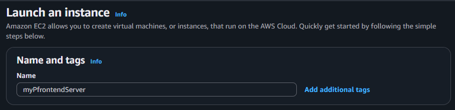
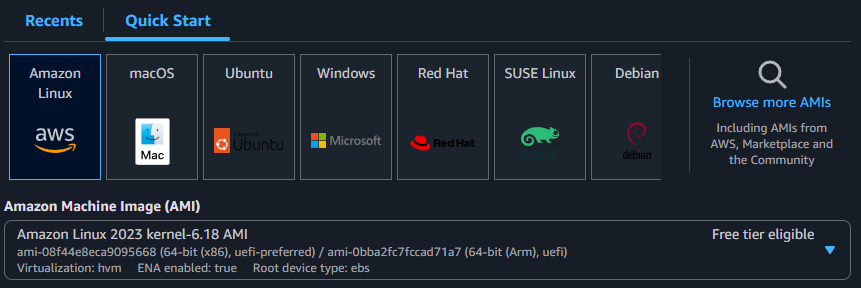
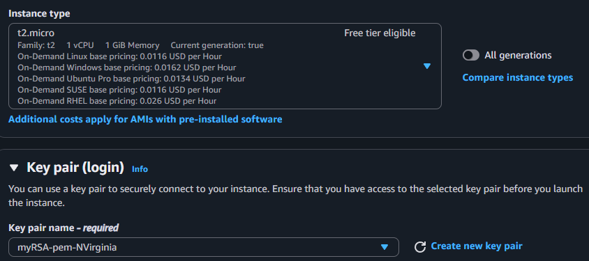
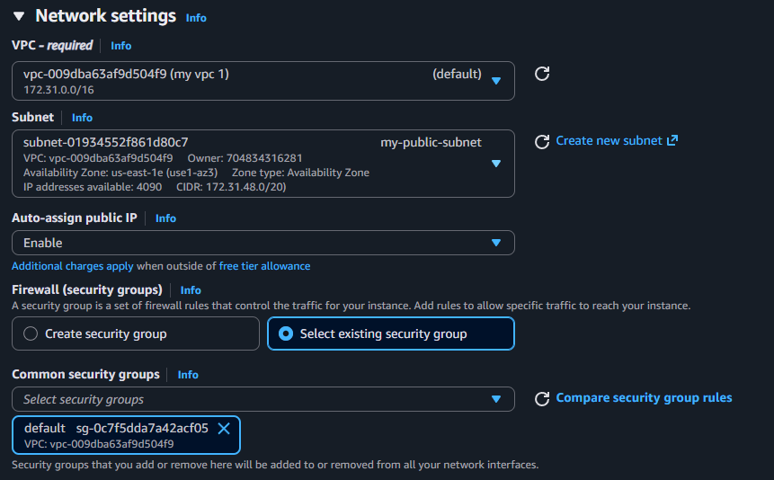
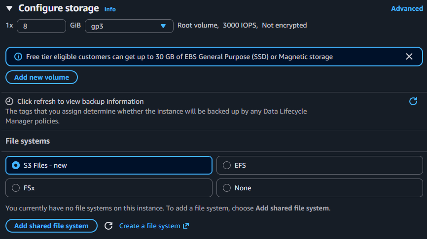

# Frontend Setup - 

aws ec2 run-instances --image-id 'ami-08f44e8eca9095668' --instance-type 't2.micro' --key-name 'myRSA-pem-NVirginia' --network-interfaces '{"SubnetId":"subnet-01934552f861d80c7","AssociatePublicIpAddress":true,"DeviceIndex":0,"Groups":["sg-0c7f5dda7a42acf05"]}' --credit-specification '{"CpuCredits":"standard"}' --tag-specifications '{"ResourceType":"instance","Tags":[{"Key":"Name","Value":"myPfrontendServer"}]}' --metadata-options '{"HttpEndpoint":"enabled","HttpPutResponseHopLimit":2,"HttpTokens":"required"}' --private-dns-name-options '{"HostnameType":"ip-name","EnableResourceNameDnsARecord":false,"EnableResourceNameDnsAAAARecord":false}' --count '1' 

