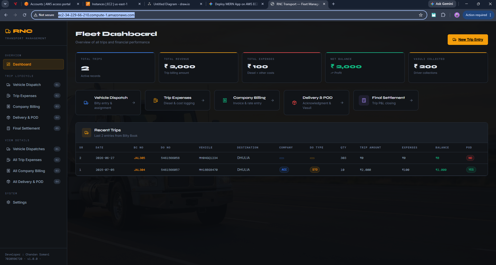
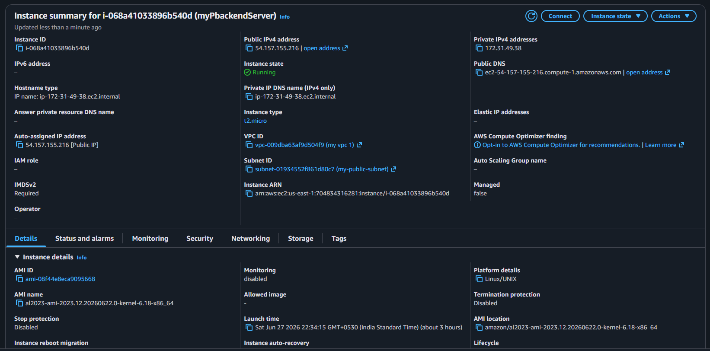
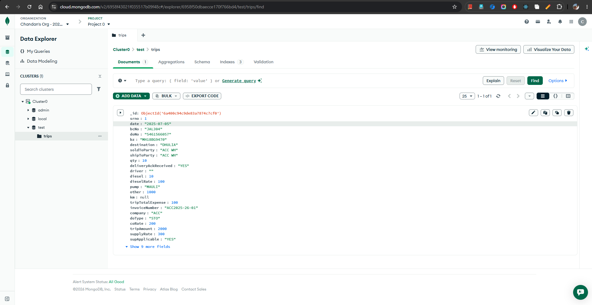

# Chandan Somani

# ID : Chandan Somani 14323

# Batch : Postgraduate Program in Multi Cloud Architecture & DevOps: Batch 17A

Github Repo 

# Github Repo  [https://github.com/hvchandansomani/hv-aws-webapp-1](https://github.com/hvchandansomani/hv-aws-webapp-1)

## Frontend : http://ec2-34-229-66-210.compute-1.amazonaws.com/

[Frontend - readme.pdf](aws-assignment/frontend/readme.pdf)

## Backend : 

> Public DNS : ec2-54-157-155-216.compute-1.amazonaws.com | open address 

- Used same from frontend app ( ENV ) to point to backend API evenwithout Domain Name

### Used 

- Setup Security Groups
- Setup VPC, Subent, Internet Gateway, Route Tables
- EC2 INstance 

Key pair assigned at launch
myRSA-pem-NVirginia

- Learn Setting up manually SSH Secrets on EC2-Instance, support multiple RSA Priates keys SSH, Putty, WinScp using PuttyKeygen, PPK files
- Setup Fresh Editor
- Setup VSCode Remote Connection 

[aws-assignment/backend/readme.pdf](aws-assignment/backend/readme.pdf)

## Database : 

## Arch Daigram : 

Visit WebApp : 

# RNC Transport Dashborad management
### http://ec2-34-229-66-210.compute-1.amazonaws.com/